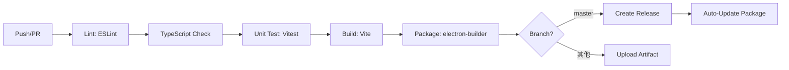
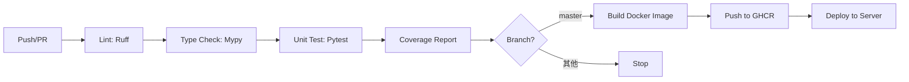
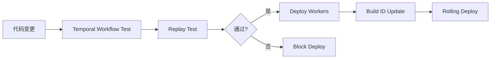

# AutoGeo CI/CD 标准化流程方案

> **版本**: v1.0
> **创建日期**: 2026-02-11
> **维护者**: 老王
> **架构**: GitHub + Temporal + Docker + 云原生部署

---

## 📋 目录

1. [整体架构](#整体架构)
2. [技术选型](#技术选型)
3. [CI/CD 流程设计](#cicd-流程设计)
4. [GitHub Actions 配置](#github-actions-配置)
5. [Temporal 工作流集成](#temporal-工作流集成)
6. [部署策略](#部署策略)
7. [监控与告警](#监控与告警)
8. [实施步骤](#实施步骤)

---

## 整体架构

```
┌─────────────────────────────────────────────────────────────────────────────────────┐
│                              AutoGeo CI/CD 架构 v1.0                                   │
├─────────────────────────────────────────────────────────────────────────────────────┤
│                                                                                     │
│  ┌──────────────────────┐         ┌──────────────────────┐         ┌──────────────┐│
│  │   GitHub 仓库        │         │    Temporal Server   │         │   Docker Hub  ││
│  │                      │         │                      │         │              ││
│  │  - 源代码托管        │         │  - 工作流编排        │         │  - 镜像仓库  ││
│  │  - Actions CI/CD    │────────▶│  - 长期任务调度      │         │  - 版本管理  ││
│  │  - Packages Registry│         │  - Worker 版本管理   │         │              ││
│  └──────────┬───────────┘         └──────────┬───────────┘         └──────────────┘│
│             │                                │                                    │
│             │ webhook                        │ Activity                           │
│             ▼                                ▼                                    │
│  ┌─────────────────────────────────────────────────────────────────────────────┐  │
│  │                        CI/CD Pipeline (GitHub Actions)                         │  │
│  │  ┌─────────────┐  ┌─────────────┐  ┌─────────────┐  ┌─────────────────────┐  │  │
│  │  │  Lint 检查  │─▶│  单元测试   │─▶│  构建打包   │─▶│  部署 & 发布        │  │  │
│  │  └─────────────┘  └─────────────┘  └─────────────┘  └─────────────────────┘  │  │
│  └─────────────────────────────────────────────────────────────────────────────┘  │
│             │                                │                                    │
│             │                                │                                    │
│             ▼                                ▼                                    │
│  ┌──────────────────────┐         ┌──────────────────────┐         ┌──────────────┐│
│  │   前端产物           │         │    后端服务          │         │  Temporal    ││
│  │                      │         │                      │         │  Workers     ││
│  │  - Electron 安装包   │         │  - FastAPI 容器     │         │              ││
│  │  - Release 资产     │         │  - Playwright Worker │         │  - GEO 生成  ││
│  │  - 自动更新包       │         │  - 发布 Worker      │         │  - 定时任务  ││
│  └──────────────────────┘         └──────────────────────┘         └──────────────┘│
└─────────────────────────────────────────────────────────────────────────────────────┘
```

---

## 技术选型

### 1. CI/CD 平台

| 组件 | 技术选型 | 版本 | 用途 |
|------|---------|------|------|
| **代码托管** | GitHub | - | 源代码管理、Issue/PR 流程 |
| **CI/CD 引擎** | GitHub Actions | - | 自动化构建、测试、部署 |
| **容器镜像** | GitHub Container Registry | - | Docker 镜像存储 |
| **包管理** | GitHub Packages | - | npm、PyPI 包托管 |

### 2. 工作流编排

| 组件 | 技术选型 | 版本 | 用途 |
|------|---------|------|------|
| **工作流引擎** | Temporal | 1.24+ | 长期任务编排、重试、补偿 |
| **Temporal Server** | Temporal Cloud / 自托管 | 1.24+ | 生产级集群 |
| **Python SDK** | temporalio | 1.7+ | Python Worker |
| **TypeScript SDK** | temporalio | 1.10+ | Node.js Worker |

### 3. 构建工具

| 组件 | 技术选型 | 版本 | 用途 |
|------|---------|------|------|
| **前端构建** | Vite | 5.0+ | Vue3 打包 |
| **Electron 打包** | electron-builder | 24.0+ | 跨平台安装包 |
| **Python 构建** | UV | 0.5+ | 快速依赖管理 |
| **容器化** | Docker | 24.0+ | 镜像构建 |

---

## CI/CD 流程设计

### 前端 CI/CD (Electron + Vue3)



### 后端 CI/CD (FastAPI + Python)



### Temporal 工作流集成



---

## GitHub Actions 配置

### 目录结构

```
.github/
├── workflows/
│   ├── frontend-ci.yml          # 前端 CI
│   ├── frontend-release.yml     # 前端发布
│   ├── backend-ci.yml           # 后端 CI
│   ├── backend-deploy.yml       # 后端部署
│   ├── temporal-test.yml        # Temporal 测试
│   └── dependency-review.yml    # 依赖审查
├── actions/
│   └── setup-temporal/          # 自定义 Temporal 设置 Action
└── CODEOWNERS                   # 代码所有者配置
```

### 1. 前端 CI 配置

```yaml
# .github/workflows/frontend-ci.yml
name: Frontend CI

on:
  push:
    branches: ['**']
    paths:
      - 'fronted/**'
      - '.github/workflows/frontend-ci.yml'
  pull_request:
    branches: [master, dev]
    paths:
      - 'fronted/**'

env:
  NODE_VERSION: '20'
  PNPM_VERSION: '8'

jobs:
  lint:
    name: Lint & Type Check
    runs-on: ubuntu-latest
    defaults:
      run:
        working-directory: ./fronted

    steps:
      - name: Checkout
        uses: actions/checkout@v4

      - name: Setup pnpm
        uses: pnpm/action-setup@v2
        with:
          version: ${{ env.PNPM_VERSION }}

      - name: Setup Node.js
        uses: actions/setup-node@v4
        with:
          node-version: ${{ env.NODE_VERSION }}
          cache: 'pnpm'
          cache-dependency-path: fronted/pnpm-lock.yaml

      - name: Install dependencies
        run: pnpm install --frozen-lockfile

      - name: Run ESLint
        run: pnpm lint

      - name: Run TypeScript check
        run: pnpm type-check

  test:
    name: Unit Tests
    runs-on: ubuntu-latest
    defaults:
      run:
        working-directory: ./fronted
    needs: lint

    steps:
      - name: Checkout
        uses: actions/checkout@v4

      - name: Setup pnpm
        uses: pnpm/action-setup@v2
        with:
          version: ${{ env.PNPM_VERSION }}

      - name: Setup Node.js
        uses: actions/setup-node@v4
        with:
          node-version: ${{ env.NODE_VERSION }}
          cache: 'pnpm'
          cache-dependency-path: fronted/pnpm-lock.yaml

      - name: Install dependencies
        run: pnpm install --frozen-lockfile

      - name: Run Vitest
        run: pnpm test:unit --coverage

      - name: Upload coverage
        uses: codecov/codecov-action@v3
        with:
          files: fronted/coverage/lcov.info
          flags: frontend

  build:
    name: Build Check
    runs-on: ubuntu-latest
    defaults:
      run:
        working-directory: ./fronted
    needs: [lint, test]

    steps:
      - name: Checkout
        uses: actions/checkout@v4

      - name: Setup pnpm
        uses: pnpm/action-setup@v2
        with:
          version: ${{ env.PNPM_VERSION }}

      - name: Setup Node.js
        uses: actions/setup-node@v4
        with:
          node-version: ${{ env.NODE_VERSION }}
          cache: 'pnpm'
          cache-dependency-path: fronted/pnpm-lock.yaml

      - name: Install dependencies
        run: pnpm install --frozen-lockfile

      - name: Build
        run: pnpm build

      - name: Upload build artifacts
        uses: actions/upload-artifact@v4
        with:
          name: frontend-dist
          path: fronted/dist
          retention-days: 7
```

### 2. 前端发布配置

```yaml
# .github/workflows/frontend-release.yml
name: Frontend Release

on:
  push:
    tags:
      - 'v*.*.*'

env:
  NODE_VERSION: '20'
  PNPM_VERSION: '8'

jobs:
  release:
    name: Build & Release
    runs-on: ${{ matrix.os }}

    strategy:
      matrix:
        os: [ubuntu-latest, windows-latest, macos-latest]
        include:
          - os: ubuntu-latest
            platform: linux
          - os: windows-latest
            platform: windows
          - os: macos-latest
            platform: macos

    defaults:
      run:
        working-directory: ./fronted

    steps:
      - name: Checkout
        uses: actions/checkout@v4
        with:
          fetch-depth: 0

      - name: Setup pnpm
        uses: pnpm/action-setup@v2
        with:
          version: ${{ env.PNPM_VERSION }}

      - name: Setup Node.js
        uses: actions/setup-node@v4
        with:
          node-version: ${{ env.NODE_VERSION }}
          cache: 'pnpm'
          cache-dependency-path: fronted/pnpm-lock.yaml

      - name: Install dependencies
        run: pnpm install --frozen-lockfile

      - name: Build
        run: pnpm build

      - name: Install native dependencies
        run: pnpm install --no-save
        env:
          PLAYWRIGHT_BROWSERS_PATH: ${{ github.workspace }}/fronted/.playwright

      - name: Build Electron app
        run: pnpm build:electron
        env:
          GH_TOKEN: ${{ secrets.GITHUB_TOKEN }}

      - name: Upload artifacts
        uses: softprops/action-gh-release@v1
        with:
          files: |
            fronted/dist/*.exe
            fronted/dist/*.dmg
            fronted/dist/*.AppImage
            fronted/dist/*.deb
            fronted/dist/*.rpm
            fronted/dist/*.snap
            fronted/dist/*.zip
          draft: false
          prerelease: false
          generate_release_notes: true
        env:
          GITHUB_TOKEN: ${{ secrets.GITHUB_TOKEN }}
```

### 3. 后端 CI 配置

```yaml
# .github/workflows/backend-ci.yml
name: Backend CI

on:
  push:
    branches: ['**']
    paths:
      - 'backend/**'
      - '.github/workflows/backend-ci.yml'
  pull_request:
    branches: [master, dev]
    paths:
      - 'backend/**'

env:
  PYTHON_VERSION: '3.12'

jobs:
  lint:
    name: Lint & Type Check
    runs-on: ubuntu-latest

    steps:
      - name: Checkout
        uses: actions/checkout@v4

      - name: Install uv
        run: |
          curl -LsSf https://astral.sh/uv/install.sh | sh
          echo "$HOME/.cargo/bin" >> $GITHUB_PATH

      - name: Set up Python
        uses: actions/setup-python@v5
        with:
          python-version: ${{ env.PYTHON_VERSION }}
          cache: 'uv'

      - name: Install dependencies
        working-directory: ./backend
        run: |
          uv pip install -r requirements.txt
          uv pip install ruff mypy

      - name: Run Ruff
        working-directory: ./backend
        run: |
          ruff check .
          ruff format --check .

      - name: Run MyPy
        working-directory: ./backend
        run: mypi --ignore-missing-imports api/

  test:
    name: Unit Tests
    runs-on: ubuntu-latest
    needs: lint

    services:
      postgres:
        image: postgres:16
        env:
          POSTGRES_USER: test
          POSTGRES_PASSWORD: test
          POSTGRES_DB: test_db
        options: >-
          --health-cmd pg_isready
          --health-interval 10s
          --health-timeout 5s
          --health-retries 5

    steps:
      - name: Checkout
        uses: actions/checkout@v4

      - name: Install uv
        run: |
          curl -LsSf https://astral.sh/uv/install.sh | sh
          echo "$HOME/.cargo/bin" >> $GITHUB_PATH

      - name: Set up Python
        uses: actions/setup-python@v5
        with:
          python-version: ${{ env.PYTHON_VERSION }}
          cache: 'uv'

      - name: Install dependencies
        working-directory: ./backend
        run: uv pip install -r requirements.txt

      - name: Install Playwright browsers
        run: playwright install chromium

      - name: Run tests
        working-directory: ./backend
        run: |
          pytest tests/ -v \
            --cov=api \
            --cov=services \
            --cov-report=xml \
            --cov-report=term

      - name: Upload coverage
        uses: codecov/codecov-action@v3
        with:
          files: backend/coverage.xml
          flags: backend

  security:
    name: Security Scan
    runs-on: ubuntu-latest

    steps:
      - name: Checkout
        uses: actions/checkout@v4

      - name: Run Bandit
        uses: shpigford/actions-bandit@master
        with:
          path: backend

      - name: Run Trivy
        uses: aquasecurity/trivy-action@master
        with:
          scan-type: 'fs'
          scan-ref: './backend'
          format: 'sarif'
          output: 'trivy-results.sarif'

      - name: Upload Trivy results
        uses: github/codeql-action/upload-sarif@v2
        with:
          sarif_file: 'trivy-results.sarif'
```

### 4. 后端部署配置

```yaml
# .github/workflows/backend-deploy.yml
name: Backend Deploy

on:
  push:
    branches: [master]
    paths:
      - 'backend/**'
  workflow_dispatch:

env:
  PYTHON_VERSION: '3.12'
  REGISTRY: ghcr.io
  IMAGE_NAME: auto_geo_backend

jobs:
  build-and-push:
    name: Build & Push Docker Image
    runs-on: ubuntu-latest
    permissions:
      contents: read
      packages: write

    steps:
      - name: Checkout
        uses: actions/checkout@v4

      - name: Set up Docker Buildx
        uses: docker/setup-buildx-action@v3

      - name: Log in to GHCR
        uses: docker/login-action@v3
        with:
          registry: ${{ env.REGISTRY }}
          username: ${{ github.actor }}
          password: ${{ secrets.GITHUB_TOKEN }}

      - name: Extract metadata
        id: meta
        uses: docker/metadata-action@v5
        with:
          images: ${{ env.REGISTRY }}/${{ github.repository_owner }}/${{ env.IMAGE_NAME }}
          tags: |
            type=sha,prefix={{branch}}-
            type=raw,value=latest,enable={{is_default_branch}}

      - name: Build and push
        uses: docker/build-push-action@v5
        with:
          context: ./backend
          push: true
          tags: ${{ steps.meta.outputs.tags }}
          labels: ${{ steps.meta.outputs.labels }}
          cache-from: type=gha
          cache-to: type=gha,mode=max
          build-args: |
            BUILD_DATE=${{ github.event.head_commit.timestamp }}
            VCS_REF=${{ github.sha }}

  deploy:
    name: Deploy to Server
    runs-on: ubuntu-latest
    needs: build-and-push
    environment:
      name: production
      url: https://your-server.com

    steps:
      - name: Checkout
        uses: actions/checkout@v4

      - name: Deploy via SSH
        uses: appleboy/ssh-action@v1.0.0
        with:
          host: ${{ secrets.SERVER_HOST }}
          username: ${{ secrets.SERVER_USER }}
          key: ${{ secrets.SERVER_SSH_KEY }}
          script: |
            cd /opt/auto_geo
            docker-compose pull backend
            docker-compose up -d backend
            docker image prune -f

      - name: Health check
        run: |
          sleep 10
          curl -f ${{ secrets.API_URL }}/health || exit 1

      - name: Notify deployment
        if: always()
        uses: 8398a7/action-slack@v3
        with:
          status: ${{ job.status }}
          text: |
            Backend deployment ${{ job.status }}
            Commit: ${{ github.sha }}
            Author: ${{ github.actor }}
          webhook_url: ${{ secrets.SLACK_WEBHOOK }}
```

### 5. Temporal 测试配置

```yaml
# .github/workflows/temporal-test.yml
name: Temporal Workflow Tests

on:
  push:
    branches: [master, dev]
    paths:
      - 'backend/services/temporal_workflows/**'
      - 'backend/services/temporal_activities/**'
  pull_request:
    paths:
      - 'backend/services/temporal_*/**'

env:
  PYTHON_VERSION: '3.12'
  TEMPORAL_VERSION: '1.24.0'

jobs:
  workflow-unit-tests:
    name: Workflow Unit Tests
    runs-on: ubuntu-latest

    steps:
      - name: Checkout
        uses: actions/checkout@v4

      - name: Start Temporal Server
        run: |
          docker run -d --name temporal \
            -p 7233:7233 \
            -e TEMPORAL_CLI_ADDRESS=localhost:7233 \
            temporalio/auto-setup:${{ env.TEMPORAL_VERSION }}

      - name: Wait for Temporal
        run: |
          for i in {1..30}; do
            if nc -z localhost 7233; then
              echo "Temporal is ready"
              break
            fi
            echo "Waiting for Temporal... ($i/30)"
            sleep 2
          done

      - name: Install uv
        run: |
          curl -LsSf https://astral.sh/uv/install.sh | sh
          echo "$HOME/.cargo/bin" >> $GITHUB_PATH

      - name: Set up Python
        uses: actions/setup-python@v5
        with:
          python-version: ${{ env.PYTHON_VERSION }}
          cache: 'uv'

      - name: Install dependencies
        working-directory: ./backend
        run: |
          uv pip install -r requirements.txt
          uv pip install pytest-asyncio

      - name: Run workflow tests
        working-directory: ./backend
        run: |
          pytest tests/temporal_workflows/ -v \
            --cov=services.temporal_workflows \
            --cov-report=xml

  replay-tests:
    name: Workflow Replay Tests
    runs-on: ubuntu-latest
    needs: workflow-unit-tests

    steps:
      - name: Checkout
        uses: actions/checkout@v4

      - name: Download workflow histories
        env:
          TEMPORAL_ADDRESS: ${{ secrets.TEMPORAL_ADDRESS }}
          TEMPORAL_NAMESPACE: ${{ secrets.TEMPORAL_NAMESPACE }}
        run: |
          # 从 Temporal Cloud 导出历史用于回放测试
          python backend/scripts/export_histories.py

      - name: Run replay tests
        working-directory: ./backend
        run: |
          pytest tests/temporal_replay/ -v

  deploy-workers:
    name: Deploy Temporal Workers
    runs-on: ubuntu-latest
    needs: [workflow-unit-tests, replay-tests]
    if: github.ref == 'refs/heads/master'

    steps:
      - name: Checkout
        uses: actions/checkout@v4

      - name: Set BUILD_ID
        id: build_id
        run: |
          BUILD_ID="${{ github.sha }}-${{ github.run_number }}"
          echo "build_id=$BUILD_ID" >> $GITHUB_OUTPUT
          echo "BUILD_ID=$BUILD_ID" >> $GITHUB_ENV

      - name: Deploy Workers
        run: |
          # 部署新 Worker 并设置 Build ID
          # ...
          echo "Deployed workers with BUILD_ID=$BUILD_ID"
```

---

## Temporal 工作流集成

### 1. 工作流架构

```
Temporal Namespaces
├── auto_geo_production     # 生产环境
│   ├── Task Queues
│   │   ├── geo-generation-queue    # GEO 文章生成
│   │   ├── publish-queue           # 文章发布
│   │   ├── index-check-queue       # 收录检测
│   │   └── scheduler-queue         # 定时任务
│   └── Workflows
│       ├── GeoArticleWorkflow      # 文章生成工作流
│       ├── PublishWorkflow         # 发布工作流
│       └── IndexCheckWorkflow      # 收录检测工作流
│
└── auto_geo_staging        # 测试环境
    └── ...
```

### 2. Worker 版本管理

```python
# backend/services/temporal_workers/worker.py
from datetime import timedelta
from temporalio import workflow, activity
from temporalio.client import Client
from temporalio.worker import Worker
from temporalio.contrib.pydantic import pydantic_data_converter

import asyncio
import os

# 从环境变量获取 Build ID（CI/CD 设置）
BUILD_ID = os.getenv("TEMPORAL_WORKER_BUILD_ID", "dev")

async def main():
    # 连接 Temporal Server
    client = await Client.connect(
        os.getenv("TEMPORAL_HOST_URL"),
        namespace=os.getenv("TEMPORAL_NAMESPACE", "default"),
    )

    # 创建 Worker，启用 Build ID 版本管理
    worker = Worker(
        client,
        task_queue=os.getenv("TEMPORAL_TASK_QUEUE", "geo-task-queue"),
        workflows=[...],  # 工作流列表
        activities=[...],  # Activity 列表
        data_converter=pydantic_data_converter,
        # 关键：Build ID 用于版本控制
        build_id=BUILD_ID,
        # 使用单一版本确保一致性
        use_worker_versioning=True,
    )

    print(f"Starting Worker with BUILD_ID={BUILD_ID}")
    await worker.run()


if __name__ == "__main__":
    asyncio.run(main())
```

### 3. 工作流示例

```python
# backend/services/temporal_workflows/geo_article.py
from datetime import timedelta
from dataclasses import dataclass
from temporalio import workflow
from temporalio.common import RetryPolicy

with workflow.unsafe.imports_passed_through():
    from ..temporal_activities.geo_activities import (
        generate_outline,
        generate_content,
        quality_check,
        save_article,
    )


@dataclass
class GeoArticleInput:
    project_id: int
    keyword_id: int
    style: str = "professional"


@workflow.defn
class GeoArticleWorkflow:
    """GEO 文章生成工作流"""

    @workflow.run
    async def run(self, input: GeoArticleInput) -> str:
        """执行完整的工作流"""

        # Step 1: 生成文章大纲
        outline = await workflow.execute_activity(
            generate_outline,
            args=[input.keyword_id],
            start_to_close_timeout=timedelta(minutes=5),
            retry_policy=RetryPolicy(
                maximum_attempts=3,
                initial_interval=timedelta(seconds=30),
            ),
        )

        # Step 2: 生成正文内容
        content = await workflow.execute_activity(
            generate_content,
            args=[input.keyword_id, outline, input.style],
            start_to_close_timeout=timedelta(minutes=10),
            retry_policy=RetryPolicy(
                maximum_attempts=3,
                initial_interval=timedelta(seconds=60),
            ),
        )

        # Step 3: 质量检查
        quality_result = await workflow.execute_activity(
            quality_check,
            args=[content],
            start_to_close_timeout=timedelta(minutes=3),
        )

        if not quality_result["passed"]:
            # 质检不合格，调整参数重试
            workflow.logger.warning(f"Quality check failed: {quality_result['reason']}")

        # Step 4: 保存文章
        article_id = await workflow.execute_activity(
            save_article,
            args=[input.project_id, input.keyword_id, content],
            start_to_close_timeout=timedelta(minutes=2),
        )

        workflow.logger.info(f"Article generated: {article_id}")
        return article_id
```

---

## 部署策略

### 1. 部署架构

```
┌─────────────────────────────────────────────────────────────────┐
│                        生产服务器                               │
├─────────────────────────────────────────────────────────────────┤
│                                                                 │
│  ┌───────────────────────────────────────────────────────────┐  │
│  │                    Docker Compose                          │  │
│  │                                                            │  │
│  │  ┌─────────────┐  ┌─────────────┐  ┌─────────────┐       │  │
│  │  │   Nginx     │  │  FastAPI    │  │   Worker    │       │  │
│  │  │  (反向代理)  │  │  (后端API)   │  │ (Temporal)  │       │  │
│  │  │   :80/443   │─▶│   :8001     │  │    :8002     │       │  │
│  │  └─────────────┘  └─────────────┘  └─────────────┘       │  │
│  │                                                            │  │
│  │  ┌─────────────┐  ┌─────────────┐  ┌─────────────┐       │  │
│  │  │   n8n       │  │  Playwright │  │    SQLite   │       │  │
│  │  │  :5678      │  │   Browser   │  │  (数据存储)   │       │  │
│  │  └─────────────┘  └─────────────┘  └─────────────┘       │  │
│  └───────────────────────────────────────────────────────────┘  │
│                                                                 │
│  ┌───────────────────────────────────────────────────────────┐  │
│  │                    数据卷                                  │  │
│  │  - backend_data: SQLite 数据库                            │  │
│  │  - playwright_cache: 浏览器缓存                           │  │
│  │  - n8n_data: n8n 工作流数据                               │  │
│  └───────────────────────────────────────────────────────────┘  │
└─────────────────────────────────────────────────────────────────┘
```

### 2. Docker Compose 配置

```yaml
# docker-compose.yml
version: '3.8'

services:
  nginx:
    image: nginx:alpine
    ports:
      - "80:80"
      - "443:443"
    volumes:
      - ./nginx/nginx.conf:/etc/nginx/nginx.conf:ro
      - ./nginx/ssl:/etc/nginx/ssl:ro
    depends_on:
      - backend
    restart: unless-stopped

  backend:
    image: ghcr.io/${GITHUB_REPOSITORY_OWNER}/auto_geo_backend:latest
    build:
      context: ./backend
      dockerfile: Dockerfile
    environment:
      - DATABASE_URL=sqlite:///data/auto_geo.db
      - TEMPORAL_HOST_URL=${TEMPORAL_HOST_URL}
      - TEMPORAL_NAMESPACE=${TEMPORAL_NAMESPACE}
      - TEMPORAL_TASK_QUEUE=geo-task-queue
      - TEMPORAL_WORKER_BUILD_ID=${BUILD_ID}
    volumes:
      - backend_data:/app/data
      - playwright_cache:/app/.cache/ms-playwright
    ports:
      - "8001:8001"
    restart: unless-stopped
    healthcheck:
      test: ["CMD", "curl", "-f", "http://localhost:8001/health"]
      interval: 30s
      timeout: 10s
      retries: 3

  temporal_worker:
    image: ghcr.io/${GITHUB_REPOSITORY_OWNER}/auto_geo_backend:latest
    command: python -m services.temporal_workers.worker
    environment:
      - TEMPORAL_HOST_URL=${TEMPORAL_HOST_URL}
      - TEMPORAL_NAMESPACE=${TEMPORAL_NAMESPACE}
      - TEMPORAL_TASK_QUEUE=geo-task-queue
      - TEMPORAL_WORKER_BUILD_ID=${BUILD_ID}
    restart: unless-stopped
    depends_on:
      - backend

  n8n:
    image: n8nio/n8n:latest
    environment:
      - N8N_BASIC_AUTH_ACTIVE=true
      - N8N_BASIC_AUTH_USER=${N8N_USER}
      - N8N_BASIC_AUTH_PASSWORD=${N8N_PASSWORD}
      - WEBHOOK_URL=https://your-domain.com/
    volumes:
      - n8n_data:/home/node/.n8n
    ports:
      - "5678:5678"
    restart: unless-stopped

volumes:
  backend_data:
  playwright_cache:
  n8n_data:
```

### 3. 发布策略

| 环境 | 分支 | 发布策略 | 自动发布 |
|------|------|---------|---------|
| **开发环境** | dev | 推送即部署 | ✅ |
| **测试环境** | test | PR 合并后部署 | ✅ |
| **预发布** | staging | 手动批准 | ❌ |
| **生产环境** | master | 手动批准 + 标签 | ❌ |

---

## 监控与告警

### 1. 监控指标

| 类别 | 指标 | 工具 |
|------|------|------|
| **CI/CD** | 构建成功率、构建时长 | GitHub Actions |
| **Temporal** | 工作流成功率、任务队列积压 | Temporal UI |
| **应用** | API 响应时间、错误率 | Sentry |
| **服务器** | CPU、内存、磁盘 | Prometheus + Grafana |

### 2. 告警配置

```yaml
# .github/workflows/notify.yml
name: Notify Deployment Status

on:
  status:
    contexts:
      - "Backend Deploy"
      - "Frontend Release"

jobs:
  notify:
    runs-on: ubuntu-latest
    if: github.event.status == 'failure'

    steps:
      - name: Send Slack notification
        uses: 8398a7/action-slack@v3
        with:
          status: failure
          text: |
            Deployment failed!
            Repo: ${{ github.repository }}
            Branch: ${{ github.ref }}
            Commit: ${{ github.sha }}
          webhook_url: ${{ secrets.SLACK_WEBHOOK }}

      - name: Create Issue
        uses: actions/github-script@v7
        with:
          script: |
            github.rest.issues.create({
              owner: context.repo.owner,
              repo: context.repo.repo,
              title: `Deployment failed: ${context.ref}`,
              body: `Commit: ${context.sha}\n\nWorkflow: ${context.workflow}`,
              labels: ['deployment', 'bug']
            })
```

---

## 实施步骤

### Phase 1: 基础设施搭建 (Week 1-2)

- [ ] 创建 GitHub Actions workflow 文件
- [ ] 配置 Docker 镜像仓库 (GHCR)
- [ ] 搭建 Temporal Cloud/自托管环境
- [ ] 配置开发环境服务器

### Phase 2: CI 流程实现 (Week 3-4)

- [ ] 前端 Lint + Test 配置
- [ ] 后端 Lint + Test 配置
- [ ] 代码覆盖率报告
- [ ] 安全扫描集成

### Phase 3: CD 流程实现 (Week 5-6)

- [ ] Docker 镜像自动构建
- [ ] 自动化部署脚本
- [ ] 环境变量管理
- [ ] 数据库迁移流程

### Phase 4: Temporal 集成 (Week 7-8)

- [ ] 工作流定义与实现
- [ ] Worker 版本管理
- [ ] 回放测试配置
- [ ] 生产环境迁移

### Phase 5: 监控与优化 (Week 9-10)

- [ ] 监控面板搭建
- [ ] 告警规则配置
- [ ] 性能优化
- [ ] 文档完善

---

## 附录

### A. 环境变量配置

```bash
# .env.example
# ===== Temporal 配置 =====
TEMPORAL_HOST_URL=your-temporal.temporal.io:7233
TEMPORAL_NAMESPACE=auto_geo_production
TEMPORAL_TASK_QUEUE=geo-task-queue
TEMPORAL_CLIENT_CERT=/path/to/cert.pem
TEMPORAL_CLIENT_KEY=/path/to/key.pem

# ===== 数据库配置 =====
DATABASE_URL=sqlite:///data/auto_geo.db

# ===== n8n 配置 =====
N8N_USER=admin
N8N_PASSWORD=your-secure-password

# ===== 服务器配置 =====
SERVER_HOST=your-server.com
SERVER_USER=deploy
SERVER_SSH_KEY_PATH=/path/to/key

# ===== 告警配置 =====
SLACK_WEBHOOK=https://hooks.slack.com/services/...
SENTRY_DSN=https://...

# ===== 加密配置 =====
ENCRYPTION_KEY=your-32-byte-encryption-key
```

### B. 相关资源

- [Temporal 官方文档](https://docs.temporal.io/)
- [GitHub Actions 文档](https://docs.github.com/en/actions)
- [electron-builder 文档](https://www.electron.build/)
- [FastAPI 部署指南](https://fastapi.tiangolo.com/deployment/)

---

**文档版本**: v1.0
**最后更新**: 2026-02-11
**维护者**: 老王
